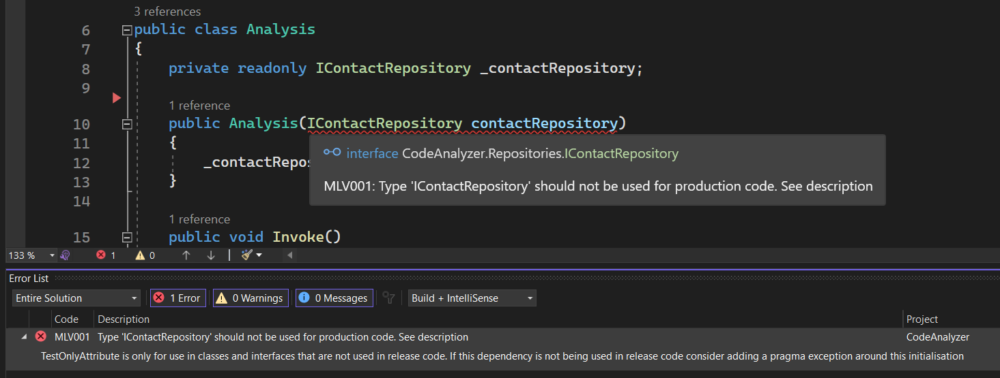
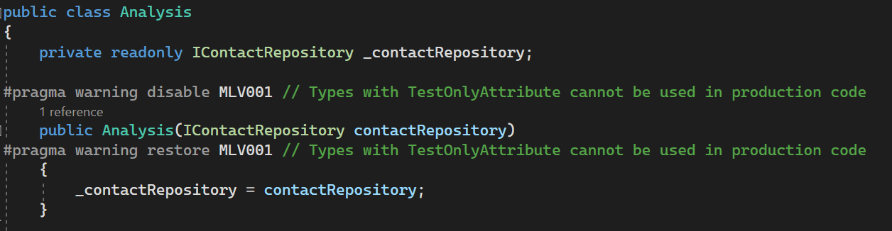
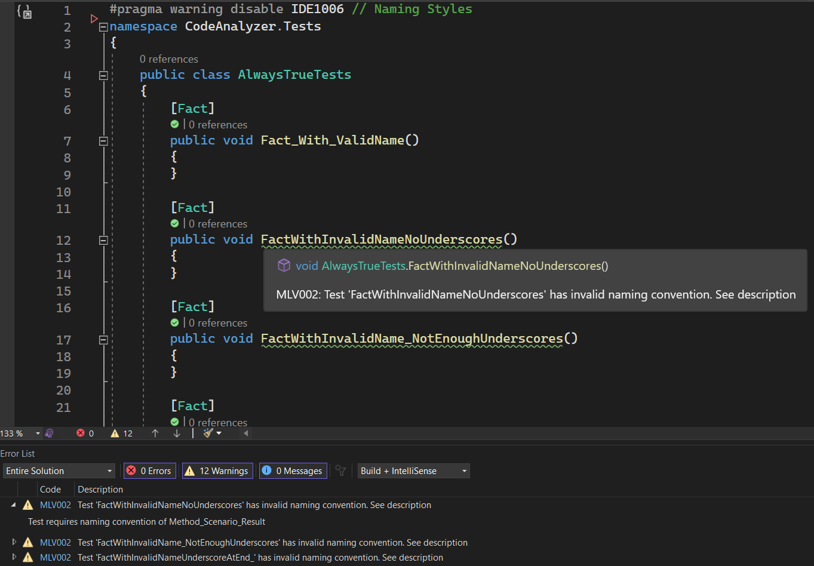
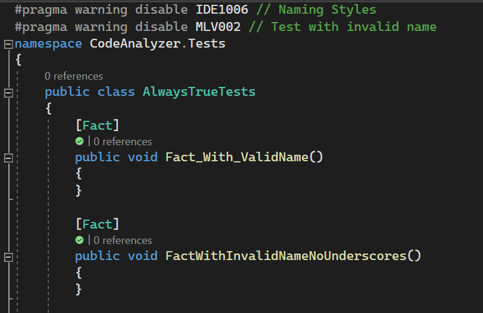

# Experimental Code Analyzers

This repository contains a number of prototype analyzers used as a learning exercise for getting to grips with Roslyn.

## Build Status

## TestOnlyAnalyzer

Prevents an interface tagged with the TestOnlyAttribute from being used as an injected dependency. Visual Studio will provide an error when the dependency is injected into a consuming class.

The solution contains a console application package that contains a basic dependency injection scenario where interface **IContactRepository** is being injected into the **Analysis** class.

The constructor parameter is currently wrapped in a pragma directive that disables the analyzer for the given code block. If the directive is removed then Visual Studio will give a build error alerting the developer that a forbidden interface has been injected.

### Pragma Directive

### Build Error

## UnitTestNameAnalyzer

Triggers a warning when a unit test name doesn't conform to a given format. In this case **'Method_Scenario_Result'**.  The analyzer is quite simple in that it only ensures there are 2 '_' characters in the middle of the string that aren't adjacent. This analyzer can be expanded in future to ensure the the correct method is being used, provided the method itself also follows a strict naming convention. E.g., the class under test is a specific name like **'sut'** which the analyzer can identify.

This analyzer supports Xunit and MSTest unit tests. 

The solution contains a test class that has been populated with a number of empty test methods (Xunit and MSTest) that can be used to functionally test the analyzer. Warnings are currently suppressed at the file level with a pragma directive.

### Pragma Directive

### Build Error

## Deployment

The analyzer has been added to the console application as a project reference but can be built as a NuGet package for deployment to a NuGet feed.

## Unit Tests

Along with the functional tests above, the solution also contains a unit test project where we can test the analysers.

To do this, we provide a test class in a string which is compiled and checked for diagnostics.

## Code Fix

The analyzer project template comes bundled with a Code Fix project. This project contains the logic that executes when you allow Visual Studio to automatically fix your analysis issues. In the supplied scenarios, we don't want to fix anything as it's up to the developer to add a pragma directive or fix manually if required. 
