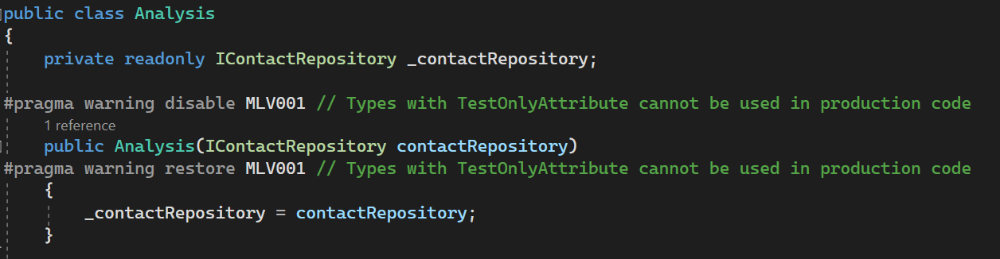
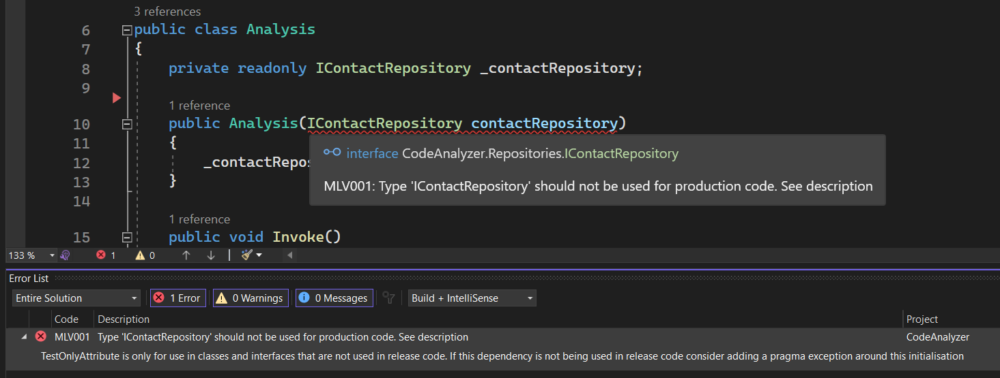

# Forbidden Custom Attribute Analyzer

Prevents an interface tagged with the TestOnlyAttribute from being used as an injected dependency. Visual Studio will provide an error when the dependency is initialised.

## Usage
 
The solution contains a console application package that contains a basic dependency injection scenario where interface **IContactRepository** is being injected into the **Analysis** class.

The constructor parameter is currently wrapped in a pragma directive that disables the analyzer for the given code block. If the directive is removed then Visual Studio will give a build error alerting the developer that a forbidden interface has been injected.

The analyzer has been added to the console application as a project reference but can be built as a Nuget package for deployment to a Nuget feed.

## Pragma Directive

## Build Error

## Unit Tests
Along with the functional test above, the solution also contains a unit test project where we can test the analyser.
>Todo: Implement unit tests

## Code Fix
The analyzer project template comes bundled with a Code Fix project. This project contains the logic that executes when you allow Visual Studio to automatically fix your analysis issues. In this scenario, we don't want to fix anything as it's up to the developer to add a pragma directive if required. 